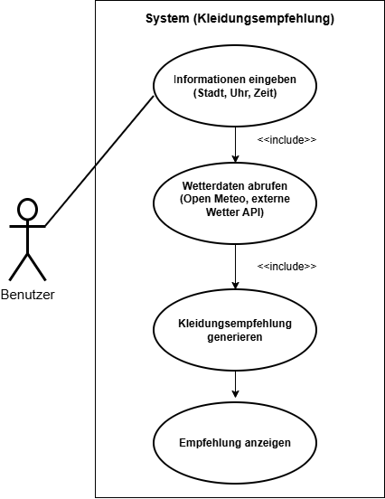
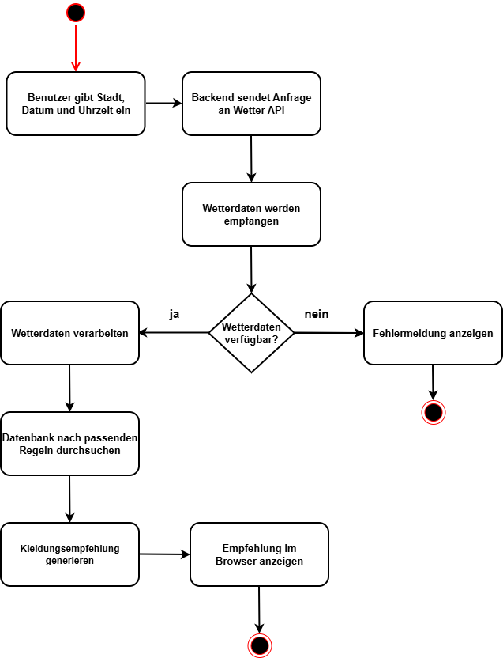
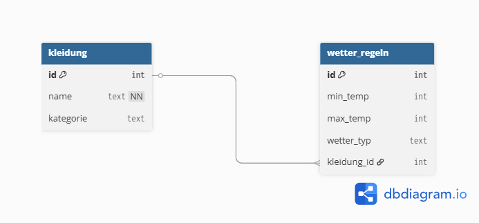
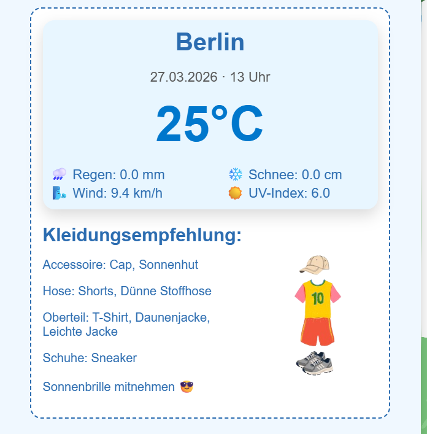
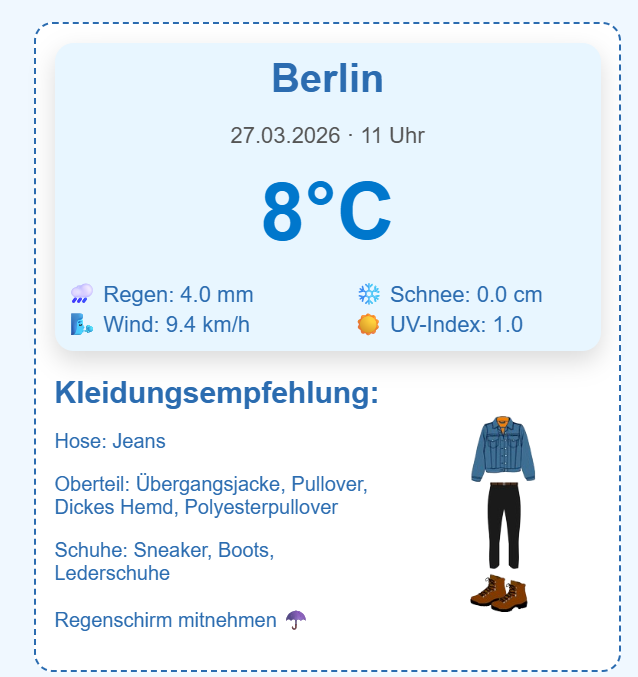
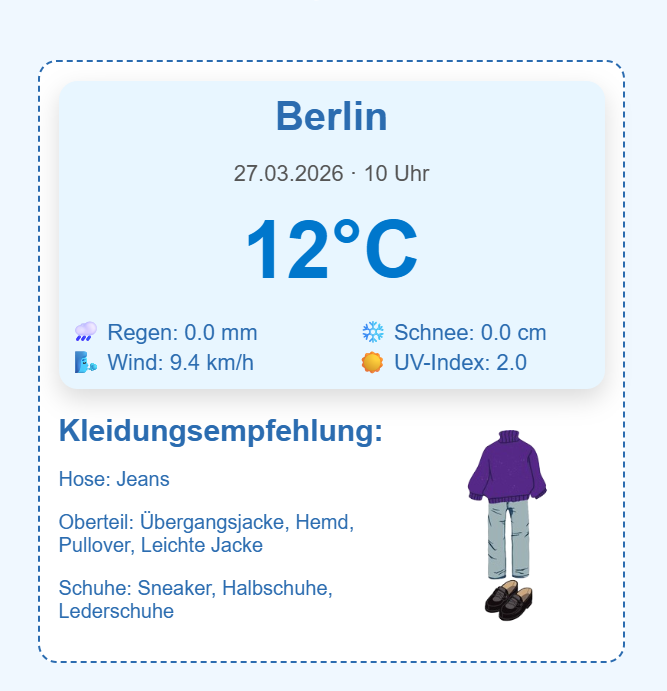

# Projektdokumentation
Kleidungsempfehlung basierend auf Wetterdaten

## 1. Einleitung

Im Rahmen dieses Projekts wird eine Webanwendung entwickelt,
die auf Basis aktueller Wetterdaten eine passende
Kleidungsempfehlung für den Benutzer generiert.

Die Anwendung ruft Wetterdaten über eine externe API ab,
verarbeitet diese Daten und vergleicht sie mit
vordefinierten Regeln in einer SQL-Datenbank.

Anhand dieser Regeln wird eine geeignete Kleidung
empfohlen und im Webbrowser angezeigt.

## 2. Projektanforderungen
Ziel des Projekts ist die Entwicklung einer Anwendung,
die Wetterinformationen automatisch verarbeitet
und dem Benutzer eine passende Kleidungsempfehlung gibt.

Der Benutzer gibt eine Stadt, ein Datum und eine Uhrzeit ein und erhält eine
Empfehlung basierend auf Temperatur, Regen, Wind und UV-Index.

## 3. Projektteam

Das Projekt wird von vier Teammitgliedern umgesetzt.

| Rolle | Aufgabe | Name |
|------|------|------|
| Backend / API | Wetter API anbinden und Daten verarbeiten | Niklas |
| Datenbank | SQLite Datenbank und Regeln erstellen | Vahit |
| Frontend | Weboberfläche mit HTML und CSS | Theresa |
| Integration / Tests / Dokumentation | Komponenten verbinden und dokumentieren | Kseniia |


## 4. Verwendete Technologien

Für die Entwicklung der Anwendung werden folgende Technologien verwendet:

Frontend
- HTML
- CSS

Backend
- Webserver mit Python und Flask

Datenbank
-SQLite
API
- externe Wetter API (Open Meteo) zur Abfrage aktueller Wetterdaten

Versionskontrolle
- Git
- GitHub

## 5. Systemarchitektur

Die Anwendung besteht aus drei Hauptkomponenten:

Frontend  
Die Benutzeroberfläche wird mit HTML und CSS erstellt.
Der Benutzer gibt eine Stadt, ein Datum und eine Uhrzeit ein.

Backend  
Das Backend verarbeitet die Anfrage und ruft
Wetterdaten über eine externe API ab.

Datenbank  
Die Datenbank speichert Regeln für verschiedene
Wetterbedingungen sowie passende Kleidungsempfehlungen.

Der Ablauf der Anwendung ist wie folgt:

1. Benutzer gibt eine Stadt, Datum und Uhrzeit ein
2. Anfrage wird an das Backend gesendet
3. Backend ruft Wetterdaten über die API ab
4. Wetterdaten werden verarbeitet
5. Datenbank wird nach passenden Regeln durchsucht
6. Kleidungsempfehlung wird an das Frontend zurückgegeben
7. Ergebnis wird im Browser angezeigt

### 5.1 Use-Case-Diagramm

Das Use-Case-Diagramm zeigt die Interaktion zwischen dem Benutzer und dem System „Kleidungsempfehlung“.

- Der Benutzer gibt die notwendigen Informationen ein: Stadt, Datum und Uhrzeit.  
- Das System ruft automatisch die Wetterdaten über die Open Meteo API ab, verarbeitet diese Daten, sucht in der Datenbank nach passenden Regeln und generiert eine Kleidungsempfehlung.  
- Abschließend wird die Empfehlung dem Benutzer im Webbrowser angezeigt.

**Abbildung: Use-Case-Diagramm der Anwendung**  



### 5.2 Activity-Diagramm

Das Activity-Diagramm zeigt den detaillierten Ablauf innerhalb des Systems:

- Start: Benutzer gibt Informationen ein  
- Entscheidung: Wetterdaten abrufen  
- Verarbeitung: Regeln prüfen  
- Generierung der Kleidungsempfehlung  
- Ende: Empfehlung anzeigen

Dieses Diagramm visualisiert die Schritte und Entscheidungen, die automatisch vom System durchgeführt werden, und zeigt die Logik hinter der Generierung der Empfehlungen.

**Abbildung: Activity-Diagramm der Anwendung**  



## 6. Datenbank
- DB Browser for SQLite: Zur visuellen Verwaltung und zum Testen der SQL-Befehle. 
- Das Projekt umfasst die Erstellung einer relationalen Datenbank zur automatisierten Kleidungsempfehlung basierend auf Wetterdaten. Das Ziel war es, eine Struktur zu schaffen, die nicht nur einfache Temperaturen berücksichtigt, sondern auch komplexe Szenarien wie Extremhitze, Regen und Schnee.
- Erstellung der Tabellen mit CREATE TABLE
- Vollständige Bestandsliste:

  ```
  SELECT k.id, k.name, k.kategorie, r.min_temp, r.max_temp, r.wetter_typ 
  FROM kleidung k
  LEFT JOIN wetter_regeln r ON k.id = r.kleidung_id;
  
- Datenintegrität: Verwendung von UNIQUE-Constraints und ON DELETE CASCADE-Regeln.
  ```
  CREATE TABLE kleidung (
  id INTEGER PRIMARY KEY AUTOINCREMENT,
  name TEXT NOT NULL UNIQUE, -- Hier ist der Constraint
  kategorie TEXT
  );
  
  CREATE TABLE wetter_regeln (
  id INTEGER PRIMARY KEY AUTOINCREMENT,
  ...
  kleidung_id INTEGER,
  FOREIGN KEY (kleidung_id) REFERENCES kleidung(id) ON DELETE CASCADE
  );
  ```

- Kombiniert mehrere Zeilen (z.B. alle Schuhe für 10°C) zu einem einzigen, kommagetrennten Textstring.
  ```
   SELECT group_concat(name, ', ') FROM kleidung ...
- Vermeidung von redundanten (doppelten) Einträgen in der Ergebnisliste.
  ```
   SELECT group_concat(DISTINCT k.name) FROM kleidung ...
- Sicherstellung der referenziellen Integrität. Wenn ein Kleidungsstück gelöscht wird, werden alle zugehörigen Wetterregeln automatisch mitgelöscht.
  ```
   FOREIGN KEY (kleidung_id) REFERENCES kleidung(id) ON DELETE CASCADE
- Entfernen von veralteten Kleidungsstücken oder fehlerhaften Wetterregeln.
  ```
  DELETE FROM kleidung WHERE id = 10;'''
- Modifikation bestehender Datensätze (z.B. Korrektur von Temperaturbereichen).
   ```
   UPDATE wetter_regeln SET max_temp = 5 WHERE max_temp = 4;
   ````

  
   ### Entity-Relationship-Diagramm (ERD)

  

Zur Visualisierung der Datenbankstruktur wurde ein **Entity-Relationship-Diagramm (ERD)** erstellt.
Für die Erstellung des Diagramms wurde das Tool [**dbdiagram.io**] (https://dbdiagram.io/home) verwendet, welches eine einfache und übersichtliche Darstellung relationaler Datenbanken ermöglicht.

Das ERD zeigt die beiden zentralen Tabellen kleidung und wetter_regeln sowie deren Beziehung zueinander.

### Beschreibung der Tabellenbeziehung

Zwischen den Tabellen kleidung und wetter_regeln besteht eine 1:n-Beziehung (One-to-Many).

Das bedeutet:

Ein Kleidungsstück kann mehreren Wetterregeln zugeordnet sein

Jede Wetterregel gehört jedoch genau zu einem Kleidungsstück

Die Verbindung wird über den Fremdschlüssel kleidung_id in der Tabelle wetter_regeln realisiert. Dieser verweist auf den Primärschlüssel id der Tabelle kleidung.

Dadurch ist sichergestellt, dass jede Wetterregel eindeutig einem existierenden Kleidungsstück zugeordnet ist.

### Zusammenhang mit dem Programmcode

Die definierte Beziehung wird direkt im Programmcode genutzt, um passende Kleidungsempfehlungen zu ermitteln.

In der Funktion db_empfehlung_items wird eine SQL-Abfrage ausgeführt, die beide Tabellen miteinander verknüpft:

```
JOIN wetter_regeln w ON k.id = w.kleidung_id
```

Anschließend werden alle Wetterregeln gefiltert, deren Temperaturbereich zur aktuellen Temperatur passt:

```
w.min_temp <= temperatur AND w.max_temp >= temperatur
```

### Zusammenfassung

Die Datenbank basiert auf einer klaren und einfachen Struktur mit zwei Tabellen, die über eine 1:n-Beziehung verbunden sind. Durch diese Verknüpfung können Wetterbedingungen effizient mit passenden Kleidungsstücken kombiniert werden. Die Logik der Empfehlung wird dabei dynamisch über die Datenbank gesteuert, was eine flexible Anpassung der Regeln ermöglicht.


## 7. Backend / API

### 7.1 Backend

#### Server starten + Flask installieren

```
pip install flask
py app.py
```

im Browser: http://127.0.0.1:5000

#### Ordnerstruktur

```
projekt/
│
├── server.py
└── templates/
    └── index.html
```

#### Datenfluss

```
Browser (HTML Formular)
        │
        │  POST request
        ▼
     Backend
        │
        │  API-CALL
        ▼
    Wetter-API
        │
        │  JSON-Response
        ▼
     Backend
        │
        │  SQL Statement
        ▼        
SQLite Datenbank
        │
        │  SQL Statement
        ▼
      Backend
        │
        │  render_template()
        ▼
    HTML/JINJA (zeigt Kleidungsitems im Frontend an)
```

### 7.2 Installation (API)

`pip install requests` (wird benötigt um Anfragen an API zu schicken)

Open Meteo:

Link zur Dokumentation: https://www.meteomatics.com/en/api/getting-started/?gl=1_1sbx4dh__up_MQ.._gs*MQ..&gclid=EAIaIQobChMIzs3A46GGkwMVnP15BB1IPxRKEAAYASAAEgIvw_D_BwE

username / password: (wird nicht benötigt)

Beispiel Wetterdaten Anfrage für Berlin:

https://api.open-meteo.com/v1/forecast?latitude=52.52&longitude=13.41&daily=uv_index_max&hourly=temperature_2m,rain,snowfall,wind_speed_10m&timezone=Europe%2FBerlin&utm_source=chatgpt.com

Parameter:

`latitude`(Längengrad)

`longitude`(Breitengrad)

`hourly`(für stündliche Angaben)

`timezone`(wichtig: Zeitzone, sollte mit angegeben werden)

`start_date`/ `end_date`(im Format YYYY-MM-DD, für den selben Tag gleicher Wert für beide Parameter)

`temperature_2m` (Temperature, 2m über Boden)

`rain`  (Niederschlag in mm)

`snowfall` (Schneefall in cm)

`wind_speed_10m` (Windgeschwindigkeit 10m über Boden)

### 7.3 API-Anfrage (open-meteo)

Für die API-Anfrage über open-meteo verwenden wir eine Funktion 'apiCall'. Dafür verwenden wir das Modul requests.

Parameter: `latitude`, `longitude`, `date`, `time`

Ablauf:

1. Definieren einer leeren Liste für das Endergebnis: `api_reply = []`

2. In der Funktion definieren wir eine url (String):

```
	url = 'https://api.open-meteo.com/v1/forecast?latitude=' + latitude + '&longitude=' + longitude + '&daily=uv_index_max&hourly=temperature_2m,rain,snowfall,wind_speed_10m&timezone=Europe%2FBerlin&start_date=' + date + '&end_date=' + date
```

2. In einem try-Block wird `url` über requests gefetcht: `response = requests.get(url)`
3. Antwort(json-Objet) wird in variabel `data` geparst
4. Für UV-Index gibt es nur einen täglichen Wert in Objekt 'daily', die anderen Werte gibt es stündlich und liegen in 'hourly'. Um den Zugriff übersichtlicher zu machen vordefinieren wir:

```
	hourly_data = data['hourly']
	daily_data = data['daily']
```

5. Daten aus `data` werden als Dictionary in `api_reply` angehangen.

```
  api_reply.append({
        "Datum" : date,
        "Uhrzeit" : time,
        "Temperatur" : hourly_data['temperature_2m'][hour_index],
        "Regen" : hourly_data['rain'][hour_index],
        "Schnee" : hourly_data['snowfall'][hour_index],
        "Wind" : hourly_data['wind_speed_10m'][hour_index],
        "UV" : daily_data['uv_index_max'][0]
        })
```
6. except-Block
7. zurückgeben von `api_reply`


Aufrufen der Funktion (mit Formulardaten):

```
	if request.method == "POST":

		standort = json.loads(request.form["standort"])
		stadtname = standort["name"]
		stunde = int(zeit[:2])

		api_response = apiCall(str(standort["Latitude"]), str(standort["Longitude"]), datum, stunde)
```

*Hinweis:* Da wir ausgehend von der open-meteo API Daten nur stündlich abfragen können, übernehmen wir nur den Stunden Wert, der Zeit aus dem Webformular. Da dieses in `zeit` im Format HH:MM ankommt, entnehmen wir über `zeit[:2]` nur die Stunden Anzahl und übergeben diesen umgewandelt als Integer in den API-Call.

Die Städte können über ein Select-Input im Frontend ausgewählt werden und kommen im Backend als JSON-Objekt an, weil wir zum einen den Stadtnamen brauchen (für User im Frontend), aber auch Längen-/Breitengrad für die API-Anfrage. Deswegen müssen wir über json.loads den entsprechenden Wert auslesen.

Momentan sind folgende Städte aufgeführt:

```
staedte = [
	{"name": "Berlin", "Latitude": 52.5200, "Longitude": 13.4050},
	{"name": "Hamburg", "Latitude": 53.5511, "Longitude": 9.9937},
	{"name": "München", "Latitude": 48.1351, "Longitude": 11.5820},
	{"name": "Köln", "Latitude": 50.9375, "Longitude": 6.9603},
	{"name": "Frankfurt am Main", "Latitude": 50.1109, "Longitude": 8.6821},
	{"name": "Stuttgart", "Latitude": 48.7758, "Longitude": 9.1829},
	{"name": "Düsseldorf", "Latitude": 51.2277, "Longitude": 6.7735},
	{"name": "Dortmund", "Latitude": 51.5136, "Longitude": 7.4653},
	{"name": "Essen", "Latitude": 51.4556, "Longitude": 7.0116},
	{"name": "Leipzig", "Latitude": 51.3397, "Longitude": 12.3731}
]
```

### 7.4 Datenbank-Abfrage (Kleiderempfehlung-Logik)

Über das Webformular im Frontend wählt der User den gewünschten Standort sowie Datum und Uhrzeit für eine Kleidungsempfehlung.

Die Daten werden ans Backend gesendet und werden dort dafür verwendet um:

1. Eine Anfrage an die Wetter-API zu senden
2. Die Antwort verwenden, um über eine Funktion eine Datenbankanfrage zu senden

Alle erhaltenen Daten und Antworten werden letztlich zurück an das Frontend übergeben. Das passiert über Python Jinja.

Beispiel (app.py):

```
return render_template(
		"index.html",
		submits=form_submits,
		datum_aktuell=datum_aktuell,
		min_date=min_date,
		max_date=max_date,
		uhrzeit_aktuell=uhrzeit_aktuell,
		stadtname=stadtname,
		api_response=api_response,
		result=result,
		staedte=staedte
	)
```
Der erste Parameter bezieht sich auf die Datei bzw. den Endpunkt zum Empfangen der Variablen (hier: index.html). Anschließend folgen die Variabelnamen und die entsprechenden Werte der Variablen aus dem Backend (app.py).

Um zum Beispiel die ausgewählte Stadt im Resultat wieder im Frontend auszugeben (Jinja-Syntax):

```
<h1> {{ stadtname }}</h1>
```


### 7.5 Funktion für die Datenbankanfrage

Um die entsprechenden Kleidungsitems aus der Datenbank zu erhalten verwenden wir eine Funktion 'db_empfehlung_items(temperature)'.

Als Argument für den Parameter 'temperature' wird entsprechend der Wert aus der API-Response benutzt:

`result = db_empfehlung_items(api_response[0]["Temperatur"])`

Erläuterung der Funktion 'db_empfehlung_items(temperature)':

1. Deklarierung einer leeren Liste für das Endergebnis ('result')
2. Sicherstellen dass der Parameter nicht None ist um Fehler abzufangen
3. Verbindung zur Datenbank erstellen, initialiseren des Cursor
4. Eine Variabel für ein SQL-Statement erstellen (String), welches nur die Zeilen der Datenbank ausgibt die nach den Wetter-Regeln innerhalb min_temp und max_temp liegen:

```
sql_stmt = """
						SELECT 
							GROUP_CONCAT(k.name, ', ') AS Kleidungsstück, 
							k.kategorie AS Kategorie, 
							w.wetter_typ AS Wetterzustand
						FROM 
							kleidung k
						JOIN 
							wetter_regeln w ON k.id = w.kleidung_id
						WHERE 
							 (
								w.min_temp <= ?
								AND w.max_temp >= ?
							)
						GROUP BY 
							Kategorie;
						"""
```
5. Die `?` werden in folgender Zeile mit der Temperatur aus der API-Response ersetzt und gleichzeitig wird das gesamte Statement ausgeführt:

`cursor.execute(sql_stmt, (temperature, temperature))`

6. Variabel 'kleidungsteile' erstellen, welche die Datenbankanfrage speichert
7. Iteration über 'kleidungsteile', um Werte in 'result' einzuhängen

```
for i, item in enumerate(kleidungsteile):
					result.append({
						"name" : item[0],
						"kategorie" : item[1],
						"wetter_typ" : item[2],
					})
```

8. Verbindung schließen

## 8. Frontend
Für die Darstellung des Frontends wird über das Python-Framework Flask eine Webanwendung erstellt.

### 8.1 Projektordner Wetter erstellen

Für die Anwendung wird ein Projektordner namens Wetter angelegt.

**mkdir Wetter**
**cd Wetter**

Der Ordner Wetter enthält später alle Dateien der Webanwendung.

### 8.2. Ordnerstruktur anlegen

Für eine Flask-App werden bestimmte Ordner benötigt.

**mkdir static**
**mkdir templates**

**static:** Enthält statische Dateien.
**templates:** Enthält HTML-Dateien der Webseite, die vom Server geladen und im Browser angezeigt werden.

### 8.3. Python-Datei erstellen

Als nächstes wird die Hauptdatei der Anwendung erstellt.

**notepad app.py**

In dieser Datei wird später der Flask-Server programmiert, der die Webseite bereitstellt.

### 8.4. Python installieren

Falls Python noch nicht installiert ist, muss es zuerst installiert werden. Nach der Installation muss noch überprüft werden, ob Python korrekt funktioniert.

**python**

Startet die Python-Konsole nun, war die Installation erfolgreich.

### 8.5. Flask installieren

Das Webframework Flask wird über die Eingabeaufforderung installiert.

**pip install flask**

Flask wird benötigt, um den Webserver zu erstellen und HTML-Seiten an den Browser zu senden. Dadurch kann die Benutzeroberfläche der WEATHER-RANGERS-App angezeigt werden.

### 8.6. Flask-Anwendung programmieren

In der Datei app.py wird der Webserver der Anwendung erstellt. Hierfür wird das Python-Framework Flask verwendet.

```
from flask import Flask, render_template
app = Flask(__name__)

@app.route("/")
def home():
	return render_template("index.html")

if __name__ == "__main__":
	app.run(debug=True)
  ```

Erklärung des Codes:

```
from flask Import Flask, render_template
```

Importiert das Flask-Framework und die Funktion render_template, mit der HTML-Dateien geladen werden können.

```
app = Flask(__name__)
```

Erstellt die Flask-Anwendung.

```
@app.route("/")
```

Legt fest, dass beim Aufruf der Startseite(/) die folgende Funktion ausgeführt wird.

```
def home():
```

Diese Funktion wird ausgeführt, wenn die Startseite aufgerufen wird.

```
return render_template("index.html")
```

Die HTML-Datei index.html aus dem Ordner templates wird geladen und an den Browser gesendet.

```
app.run(debug=True)
```

Startet den Webserver im Debug-Modus. Änderungen im Code werden dadurch automatisch erkannt.

### 8.7. Webserver starten

Nach der Erstellung der Anwendung kann der Server über die Eingabeaufforderung gestartet werden.

**python app.py**

Wurde der Server erfolgreich gestartet, erscheint in der Konsole eine Meldung mit einer lokalen Webadresse.

### 8.8. Webseite im Browser öffnen

Gibt man die folgende Adresse im Browser ein, wird die Webseite aufgerufen:

http://127.0.0.1:5000

Der Flask-Server lädt nun die Datei index.html aus dem Ordner templates und zeigt sie im Browser an.

### 8.9. HTML-Struktur der Startseite
Die Datei index.html beinhaltet die Struktur der Startseite der WEATHER-RANGERS-App.

### 8.10 Aufbau der HTML-Datei (index.html)
In der Datei index.html wird die Benutzeroberfläche der Anwendung "Weather Ranger" dargestellt. Mithilfe des Flask-Server wird sie dynamisch mit Daten befüllt und im Browser angezeigt.

Die Seite besteht aus mehreren Bereichen:

Grundstruktur und Einbindung von Ressourcen

Im <head>-Bereich werden Seitentitel und externe Ressourcen eingebunden:

-Der Seitentitel wird festgelegt
-Eine CSS-Datei (style.css) zur Gestaltung der Seite
-Eine Google-Schriftart zur optischen Aufwertung

Die CSS-Datei wird via Flask mit folgender Funktion eingebunden:

<link rel="stylesheet" href="{{ url_for('static', filename='style.css') }}">

Beschreibung der Anwendung

Im oberen Bereich der Seite wird eine kurze Erklärung der Anwendung angezeigt. Zusätzlich wird eine Liste der verfügbaren Städte dynamisch aus dem Backend geladen:


	{{ Stadt.name }}


Diese Schleife wird von der Template-Engine Jinja2 verarbeitet.

Eingabeformular

Das Formular bietet dem User die Auswahl von:

Standort(Dropdown-Menü)
Datum(Kalenderauswahl)
Uhrzeit

Die Eingaben werden per POST-Anfrage an den Flask-Server gesendet:

<form method="POST">

Für Datum und Uhrzeit werden automatische Standardwerte gesetzt, um Fehleingaben zu vermeiden.

Fehlermeldungen

Fehlermeldungen (z.B. bei ungültigen Eingaben) werden mithilfe von Flask-Funktionen angezeigt:



Diese werden dynamisch im Frontend ausgegeben.

Anzeigen der Wetterdaten

Nach dem Absenden des Formulars werden die Wetterdaten angezeigt, vorausgesetzt es liegt eine gültige API-Antwort vor:


Angezeigt werden:
Stadtname
Datum und Uhrzeit
Temperatur
Regen, Wind, Schnee und UV-Index

Kleidungsempfehlung

Die Kleidungsempfehlung wird vom Backend berechnet und im Frontend als Liste erstellt:


<p>{{ item.kategorie }}: {{ item.name }}</p>


Zusätzlich werden weitere Empfehlungen basierend auf Wetterbedingungen angezeigt:

UV-Index > 3 -> Empfehlung: Sonnenbrille
Regen > 0 -> Empfehlung: Regenschirm
Schnee > 0 -> Hinweis auf winterliche Wetterbedingungen

Darstellung von Outfit-Bildern

zur Visualisierung der Empfehlung wird abhängig von der Temperatur ein passendes Outfitbild angezeigt.

Die Temperatur wird in 5°C-Intervalle unterteilt. Für jedes Intervall wird ein dazugehöriges Bild, das sich im static-Ordner befindet gezeigt:




Dieses Prinzip wird für den Temperaturbereich von -20°C bis 60°C durchgeführt.

Dynamische Anzeige der Ergebnisse Der Bereich zur Anzeige der Wetterdaten und Empfehlungen ist standardmäßig ausgeblendet und wird erst sichtbar, wenn Daten vorhanden sind:


	style="Display:grid;"


Dadurch bleibt die Benutzeroberfläche übersichtlich und zeigt nur relevante Informationen an.

## 9. Integration

Die einzelnen Komponenten des Systems wurden schrittweise miteinander verbunden.
Zunächst wurde das Frontend mit dem Backend verbunden, sodass Benutzereingaben an den Flask-Server übermittelt werden können.
Anschließend wurde die Verbindung zur Wetter-API implementiert, um aktuelle Wetterdaten abzurufen.
Danach wurde die Datenbank integriert, um passende Kleidungsempfehlungen anhand der Wetterbedingungen zu bestimmen.
Abschließend wurde das Ergebnis wieder an das Frontend zurückgegeben und im Browser angezeigt.

## 10. Tests

**Testziel:**
Ziel des Testens war es, die korrekte Funktion der Anwendung unter verschiedenen Wetterbedingungen zu überprüfen. Dabei wurde insbesondere getestet, ob passende Kleidungsempfehlungen sowie Zusatzhinweise (z. B. Sonnenbrille, Regenschirm) abhängig von den Wetterdaten ausgegeben werden.

**Voraussetzungen:**

Die Flask-Anwendung läuft lokal.

Die Datenbank wetter.db ist vorhanden.

Die Wetter-API ist erreichbar.

**Testmethode**

Für die Tests wurden die Wetterdaten nicht ausschließlich über die API bezogen, sondern im Backend gezielt durch künstliche Werte ersetzt. Dadurch konnten verschiedene Wetterszenarien unabhängig von aktuellen Echtzeitdaten simuliert werden.

Die folgenden Parameter wurden manuell angepasst:

Temperatur
Regen
Schnee
UV-Index
Uhrzeit

Die Testwerte wurden direkt in der Funktion home() nach dem API-Aufruf gesetzt.

```
# Zum Testen, künstliche Werte erstellen:
		# Temperatur: (veränderbar)
		api_response[0]["Temperatur"] = 0.0
		# Testwert für Regen
		api_response[0]["Regen"] = 0.0
		# Testwert für Schnee
		api_response[0]["Schnee"] = 0.0
		# Testwert für UV Index
		api_response[0]["UV"] = 0.0
		api_response[0]["Uhrzeit"] = 0.0
```


### Durchgeführte Testfälle

1. Niedrige Temperatur im Winter mit Schnee und hohem UV-Wert am Abend


Benutzte Testwerte:

Temperatur: -20°C
Regen: 0.0
Schnee: 1.0
UV: 4.0
Uhrzeit: 19

**Erwartetes Ergebnis**:
Es wird geeignete Winterkleidung angezeigt, einschließlich warmer Oberbekleidung, isolierender Hosen sowie passender Accessoires.
Zusätzlich sollte eine Empfehlung für Schneekleidung erscheinen.
Die Sonnenbrillen-Empfehlung sollte trotz hohem UV-Index nicht angezeigt werden, da die Uhrzeit außerhalb des definierten Zeitfensters (7:00 - 18:00) liegt.

**Tatsächliches Ergebnis**:
Es wurde passende Winterkleidung angezeigt, darunter Thermohose, Wintermantel sowie geeignete Schuhe.
Die Empfehlung „Schneekleidung empfiehlt sich“ wurde korrekt ausgegeben.
Die Sonnenbrillen-Empfehlung wurde ebenfalls korrekt nicht angezeigt.

In der Kategorie Accessoires wurde jedoch eine doppelte bzw. redundante Ausgabe festgestellt:
„Warme Mütze, Handschuhe, Mütze, Schal“.

**Bewertung**:
Die grundlegende Logik der Anwendung funktioniert korrekt und liefert passende Empfehlungen für die gegebenen Wetterbedingungen.
Lediglich die doppelte Anzeige einzelner Kleidungsstücke stellt ein Darstellungsproblem dar.

2. Sonniger Sommertag



Temperatur: 25°C
Regen: 0.0
Schnee: 0.0
UV: 6.0
Uhrzeit: 13

**Erwartetes Ergebnis**:
Es wird leichte Sommerkleidung angezeigt, z. B. T-Shirt, Shorts und leichte Schuhe.
Zusätzlich sollte die Empfehlung „Sonnenbrille mitnehmen“ erscheinen.
Keine winterlichen oder zu warmen Kleidungsstücke sollten empfohlen werden.

**Tatsächliches Ergebnis**:
Die Anwendung zeigte passende Sommerkleidung wie T-Shirt, Shorts und Sneaker an.
Auch die Empfehlung „Sonnenbrille mitnehmen“ wurde korrekt ausgegeben.

Allerdings wurden zusätzlich „Daunenjacke“ und „Leichte Jacke“ empfohlen. Diese Kleidungsstücke sind für eine Temperatur von 25°C nur eingeschränkt bzw. nicht angemessen.

**Bewertung**:
Die Zusatzlogik für die Sonnenbrille funktioniert korrekt.
Die eigentliche Kleidungsempfehlung ist jedoch nur teilweise plausibel, da neben passender Sommerkleidung auch zu warme Oberbekleidung ausgegeben wird.

3. Regnerischer Tag bei kühler Temperatur



Temperatur: 8°C
Regen: 4.0
Schnee: 0.0
UV: 1.0
Uhrzeit: 11

**Erwartetes Ergebnis**:
Es wird geeignete Kleidung für kühle Temperaturen angezeigt, z. B. Übergangsjacke und lange Hosen.
Zusätzlich sollte die Empfehlung „Regenschirm mitnehmen“ erscheinen.
Keine Sonnenbrillen- oder Schneehinweise sollten angezeigt werden.

**Tatsächliches Ergebnis**:
Die Anwendung zeigte passende Kleidung wie Jeans, Übergangsjacke und Pullover an.
Auch die Empfehlung „Regenschirm mitnehmen“ wurde korrekt ausgegeben.

Zusätzlich wurden mehrere ähnliche Kleidungsstücke im Bereich Oberteil angezeigt, z. B. Pullover, Polyesterpullover und Dickes Hemd.

**Bewertung**:
Die grundlegende Funktionalität arbeitet korrekt, und die Empfehlungen passen grundsätzlich zur Wettersituation.
Die Ausgabe wirkt jedoch teilweise redundant und zu umfangreich.

**Ergänzende Beobachtung**:
In der Kategorie Hose wurde nur ein Kleidungsstück („Jeans“) empfohlen, während in anderen Kategorien mehrere Optionen angezeigt wurden.
Dies ist funktional korrekt, könnte jedoch im Hinblick auf Benutzerfreundlichkeit verbessert werden.

4. Kühler Tag ohne besondere Wetterbedingungen



Temperatur: 12°C
Regen: 0.0
Schnee: 0.0
UV: 2.0
Uhrzeit: 10

**Erwartetes Ergebnis**:
Es wird passende Übergangskleidung angezeigt.
Es sollten keine zusätzlichen Empfehlungen erscheinen.

**Tatsächliches Ergebnis**:
Die Anwendung zeigte geeignete Kleidung für die gegebene Temperatur an, darunter Jeans, Übergangsjacke, Hemd und Pullover.
Auch passende Schuhe wie Sneaker, Halbschuhe und Lederschuhe wurden empfohlen.

Es wurden keine zusätzlichen Hinweise (z. B. Sonnenbrille, Regen oder Schnee) angezeigt.

**Bewertung**:
Die Anwendung arbeitet korrekt.
Die Kleidungsempfehlungen sind nachvollziehbar und entsprechen den erwarteten Ergebnissen.
Es wurden keine Auffälligkeiten festgestellt.

**Test der Fehlerbehandlung**

Im Rahmen der Tests wurde auch das Verhalten der Anwendung bei fehlenden Daten überprüft.

Dabei wurde festgestellt, dass im Fall, wenn keine passende Kleidungsempfehlung aus der Datenbank zurückgegeben wird, im Frontend lediglich die Überschrift „Kleidungsempfehlung:“ ohne Inhalt angezeigt wird.

Die Implementierung dieser Funktionalität ist vorgesehen, um die Benutzerführung weiter zu verbessern.

**Zusammenfassung**

Insgesamt zeigt die Anwendung eine stabile und nachvollziehbare Funktionsweise unter verschiedenen Wetterbedingungen. Die getesteten Szenarien haben bestätigt, dass die Kernlogik zuverlässig arbeitet und passende Kleidungsempfehlungen generiert.
Kleinere Auffälligkeiten betreffen vor allem die Datenbasis und die Darstellung einzelner Empfehlungen, beeinträchtigen jedoch nicht die grundlegende Funktionalität der Anwendung.
Durch gezielte Anpassungen der zugrunde liegenden Daten und Regeln kann die Qualität der Empfehlungen weiter verbessert werden.


## 11. Fehlerbehandlung

Um die Stabilität der Anwendung zu gewährleisten, wurde eine Fehlerbehandlung konzipiert.
Dabei werden sowohl Benutzereingaben als auch mögliche Fehler bei der Kommunikation mit externen Diensten berücksichtigt.
Das Ziel ist, Systemabstürze zu vermeiden und dem Benutzer verständliche Rückmeldungen zu geben.

### 11.1 Fehler beim Abrufen der Wetterdaten

Beim Abrufen der Wetterdaten über die externe API kann es zu Problemen kommen, z.B.:

- fehlende Internetverbindung

- Server der API vorübergehend nicht erreichbar

- ungültige Antwort von der API

Zur Absicherung wurde im Backend eine Fehlerbehandlung mit try-except implementiert:

```
def apiCall(latitude, longitude, date, time):
    try:
        response = requests.get(url)
        data = response.json()

        hourly_data = data['hourly']

        api_reply.append({
            "Temperatur": hourly_data['temperature_2m'][hour_index]
        })

    except:
        flash("Wetterdaten konnten nicht geladen werden", "error")
        api_reply.append({"Temperatur": None})
```
Der API-Aufruf wird innerhalb eines try-Blocks ausgeführt. Sollte dabei ein Fehler auftreten, wird dieser im except-Block abgefangen.
Anstatt dass das Programm abstürzt, wird eine Fehlermeldung ausgegeben und ein Standardwert (None) zurückgegeben. Dadurch bleibt die Anwendung stabil und kann weiterhin ausgeführt werden.

### 11.2 Fehler bei der Datenbankverbindung

Die Anwendung stellt eine Verbindung zur SQLite-Datenbank her, um Wetterregeln und Kleidungsempfehlungen abzurufen. Dabei können folgende Probleme auftreten:

- Die Datenbankdatei wetter.db existiert nicht oder ist beschädigt

- Fehler beim Öffnen der Verbindung oder Ausführen von SQL-Abfragen

Zur Behandlung dieser Fehler wird ebenfalls ein try-except-Block verwendet:
```
def db_empfehlung_items(temperature):
    try:
        conn = sqlite3.connect(DB_NAME)
        cursor = conn.cursor()

        cursor.execute(sql_stmt, (temperature, temperature))
        kleidungsteile = cursor.fetchall()

        conn.close()

    except:
        flash("Datenbankverbindung fehlgeschlagen", "error")
```
Die Verbindung zur Datenbank sowie die Ausführung der SQL-Abfrage erfolgen innerhalb eines try-Blocks.
Falls ein Fehler auftritt, wird dieser im except-Block abgefangen und eine Fehlermeldung angezeigt.
Dadurch wird verhindert, dass die Anwendung bei Datenbankproblemen abstürzt.


### 11.3 Keine passende Kleidungsempfehlung gefunden 

**(Die Fehlermeldung ist derzeit noch nicht implementiert und stellt einen geplanten Verbesserungspunkt dar.)**

Es kann vorkommen, dass für die aktuellen Wetterbedingungen keine Regel in der Datenbank existiert. In diesem Fall sollte der Benutzer informiert werden, damit die Anwendung nicht abstürzt.

**Beispielhafte Fehlermeldung: Keine passende Kleidungsempfehlung gefunden.**

*(Hinweis: Im Backend kann dies z.B. durch eine Prüfung, ob die SQL-Abfrage ein Ergebnis liefert, und ggf. Rückgabe einer Fehlermeldung an das Frontend umgesetzt werden.)*

## 12. Installation

**Warum lokal installieren und nicht in AppData?**  
- Pakete werden **nur für dieses Projekt** installiert, nicht global für alle Python-Projekte.  
- Verhindert Konflikte zwischen verschiedenen Projekten, die unterschiedliche Versionen von Flask oder anderen Paketen brauchen.  
- Macht das Projekt **portabel**: Kollegen können die Abhängigkeiten einfach in ihrem eigenen venv installieren.  
- Globale Installation in AppData kann zu **unerwarteten Fehlern** führen, wenn andere Projekte oder Tools andere Versionen der Pakete erwarten.  

1. python -m venv venv - in root des Projekts (weather_ranger Ordner), der Befehl erstellt den Ordner der lokalen Umgebung
2. venv\Scripts\activate - der Befehl aktiviert die lokale Umgebung (danach sieht man (venv) vor dem Verzeichnis)
3. pip install -r requirements.txt - lädt alle Abhängigkeiten (dependencies) 
4. python app.py - startet lokaler Webserver


### App starten:

1. Im Terminal in den root-Ordner wechseln (Weather Rangers)
2. In Terminal eingeben: venv\Scripts\activate
3. In Terminal eingeben: py app.py
4. STRG (gedrückt halten) und auf http://127.0.0.1:5000/ klicken


### Arbeiten im Code-Editor:

1. **Wichtig: In den root-Ordner wechseln! (weather_ranger)**
2. Terminal öffnen (VSCode): 
3. CTRL + SHIFT + Ö

### Upload Github:

1. **Wichtig: In den root-Ordner wechseln! (weather_ranger)**
Funktioniert auch wenn venv aktiv
2. git pull (um den aktuellen Stand herunterzuladen)
3. git add . (um alles hinzuzufügen)
oder:
4. git add 'dateiname' (um einzel(ne) Datei(en) hinzuzufügen)
5. git commit -m 'kurze Beschreibung was geändert wurde'
6. git push

## 13. Fazit

Im Rahmen des Projekts konnte eine Webanwendung entwickelt werden, die Wetterdaten verarbeitet und daraus passende Kleidungsempfehlungen generiert.
Die Zusammenarbeit der einzelnen Komponenten – Frontend, Backend, API und Datenbank – wurde erfolgreich umgesetzt.
Durch die durchgeführten Tests konnten sowohl die Funktionsfähigkeit der Anwendung als auch kleinere Verbesserungspotenziale identifiziert werden.


